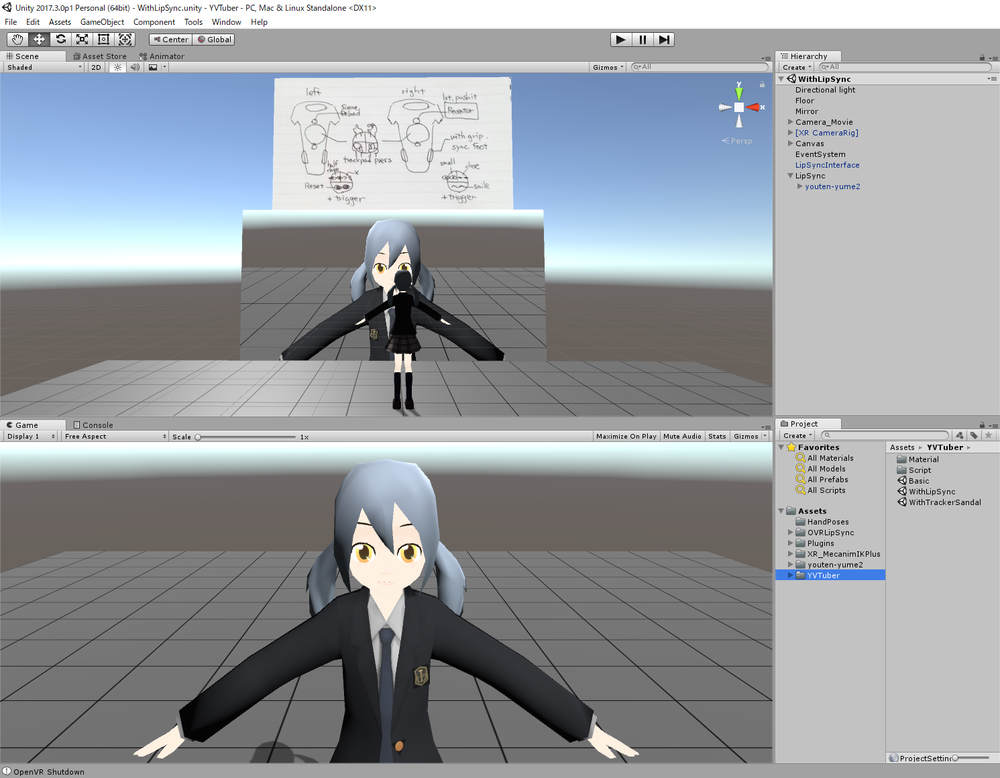

YVTuber
====
YVTuber(Yume VTuber System) is Unity project for VTuber(Virtual YouTuber).  

 

# Usage
1. Setup Steam VR (I use HTC Vive).  
2. Install Unity (I use 2017.3.1p4) and Open this Project.  
3. Open YVTuber/Basic Scnene and Play.  

# Assets and Folder description
- HandPoses: HandPoses by @m2wasabi  
- OVRLipSync: Oculus Lipsync Unity
	- https://developer.oculus.com/downloads/package/oculus-lipsync-unity/
- UnityCam: Unity3D Virtual webcam plugin by MHD Yamen Saraiji
	- https://github.com/mrayy/UnityCam
- XR_MecanimIKPlus: XR Mecanim IK Plus by @chobi_luck  
	- http://chobi-glass.com/Unity/XR_MecanimIKPlus.html
- youten-yume: 3D Model created by PMCAv0.0.6  
- YVTuber: project main folder, include scripts and etc.  

# Scenes
- Basic: Basic Scene, all assets and scripts are included in this repository. If you use OVRLipSync, you must agree EULA.  
- WithTrackerSandal: With 2 (or more)Tracker, tracking left and right feet.  

# License
apply MIT License exclude "HandPoses", "OVRLipSync", "UnityCam", "XR_MecanimIKPlus" folder, 
"YVTuber/Script/AutoBlink.cs" and some Plugins.

Copyright 2018 @youten_redo

Permission is hereby granted, free of charge, to any person obtaining a copy of this software and associated documentation files (the "Software"), to deal in the Software without restriction, including without limitation the rights to use, copy, modify, merge, publish, distribute, sublicense, and/or sell copies of the Software, and to permit persons to whom the Software is furnished to do so, subject to the following conditions:

The above copyright notice and this permission notice shall be included in all copies or substantial portions of the Software.

THE SOFTWARE IS PROVIDED "AS IS", WITHOUT WARRANTY OF ANY KIND, EXPRESS OR IMPLIED, INCLUDING BUT NOT LIMITED TO THE WARRANTIES OF MERCHANTABILITY, FITNESS FOR A PARTICULAR PURPOSE AND NONINFRINGEMENT. IN NO EVENT SHALL THE AUTHORS OR COPYRIGHT HOLDERS BE LIABLE FOR ANY CLAIM, DAMAGES OR OTHER LIABILITY, WHETHER IN AN ACTION OF CONTRACT, TORT OR OTHERWISE, ARISING FROM, OUT OF OR IN CONNECTION WITH THE SOFTWARE OR THE USE OR OTHER DEALINGS IN THE SOFTWARE.
